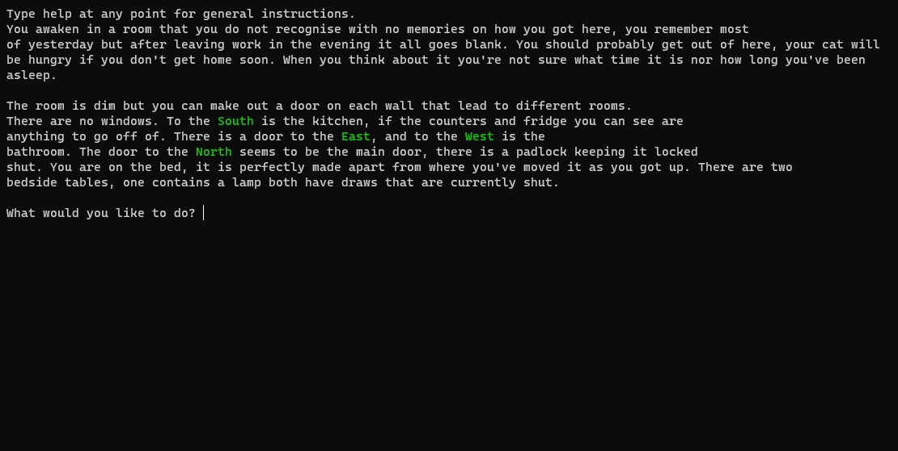

## TRAPPED

You awaken in a room that you do not recognise with no memories on how you got here, you remember most of yesterday but after leaving work in the evening it all goes blank. You should probably get out of here, your cat will be hungry if you don't get home soon. When you think about it you're not sure what time it is nor how long you've been asleep.

Your only goal is to escape and make your way home.

This game was a uni project for my Games Programming class! Game Link: https://katiem1013.itch.io/trapped

## Technologies

- Python
- Pygame

## Features

- Multiple choices and routes to choose from
- Different endings based on what choices you make
- Turn-based fighting system
- Completely Text-based game 

## The Process

This game was a university second year project. We were tasked with making a text based game using skills and features we learned in class. I decided to make a story based games with multiple routes and endings to test my abilitys and make the most of using all the functions we were taught. I planned the majority of the story out before I started and created a list of features I would need, then I researched what I would need to do to actually create these features. The game was created over a three month period, while working on other projects for other classes. I am happy with the end result but I do believe with more time I would've improved on some of the story, grammar and create a more complex ending system. 

## Preview 

